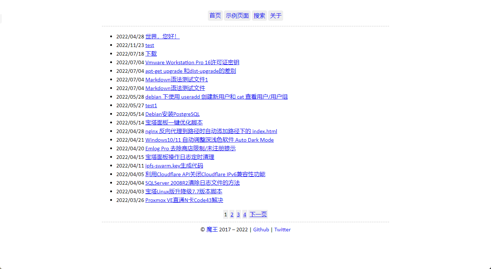

一个简单的wordpress主题

xmin主题框架来自 https://github.com/yihui/hugo-xmin ，评论框取自 https://www.olympusthemes.com/themes/arke/

使用指南：

如果你不需要高亮代码，请删除header.php中 vs2015.min.css/highlight.min.js的引用，还有footer.php中的  也要删除，再删除highlight文件夹以减轻主题大小

全局顶部菜单栏需要先注册一个菜单才可使用

搜索也需要新建一个页面，注意页面模版选择搜索

